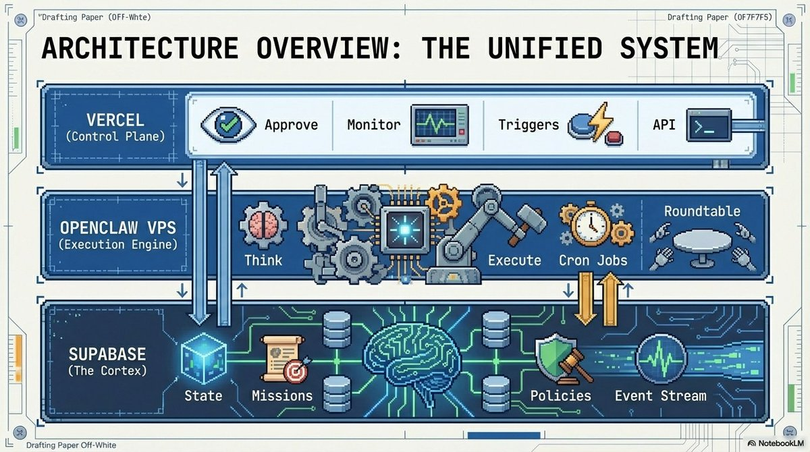
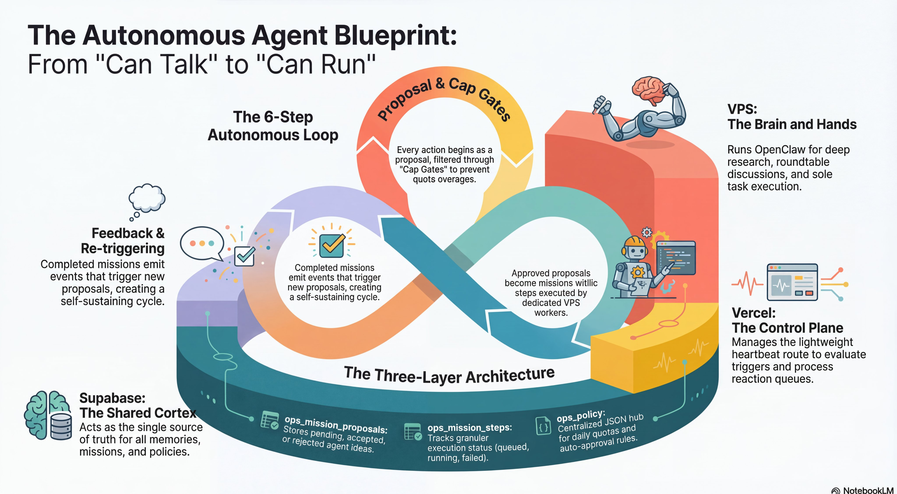
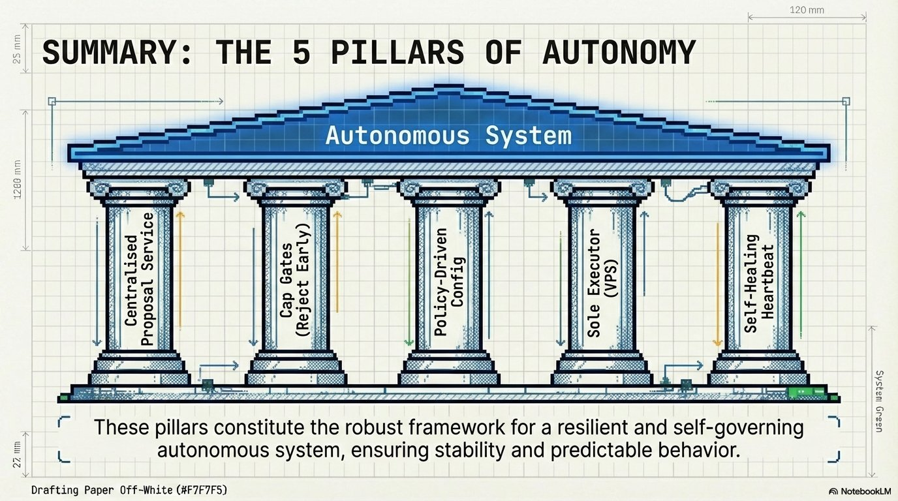
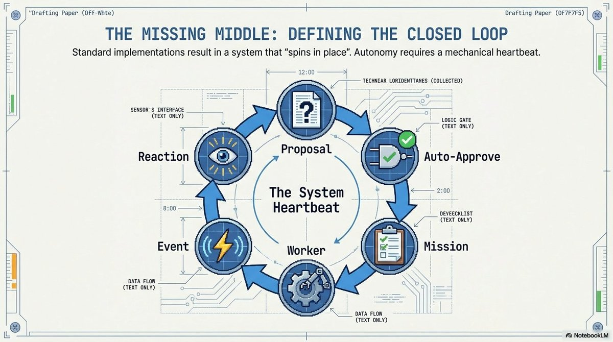

# Frasier — System Architecture

> How an autonomous AI organization runs 24/7 with zero human intervention.

---

## Architecture Overview: The Unified System

Three layers working together — the control plane (heartbeat), the execution engine (VPS workers), and the shared brain (Supabase/PostgreSQL).



- **Heartbeat** — The control plane. Polls for triggers, accepts proposals, creates missions, schedules conversations. Runs every 30 seconds.
- **VPS Workers** — The execution engine. Picks up pending tasks, constructs agent prompts with persona + memory, calls the LLM, saves results.
- **Supabase (PostgreSQL)** — The shared cortex. Single source of truth for all state, missions, policies, memories, and events. No Redis, no message queues — just tables and polling.

---

## The Autonomous Agent Blueprint

The full lifecycle from proposal to execution to feedback — and how it loops back to create a self-sustaining cycle.



- **Proposal & Cap Gates** — Every action begins as a proposal, filtered through cost and policy gates to prevent overages.
- **Mission Execution** — Approved proposals become missions with steps, executed by dedicated VPS workers.
- **Feedback & Re-triggering** — Completed missions emit events that trigger new proposals, creating the autonomous loop.
- **Three-Layer Architecture** — Supabase stores state (missions, policies, events), the VPS executes, and the heartbeat orchestrates.

---

## The 5 Pillars of Autonomy

The foundational design principles that make the system self-governing without constant human oversight.



1. **Centralised Proposal Service** — All work enters through a single proposal pipeline. No agent acts without a proposal being created and routed.
2. **Cap Gates (Reject Early)** — Cost and policy checks happen before execution, not after. Prevents runaway spending.
3. **Policy-Driven Config** — Rules live in the database (`ops_policy` table), not in code. Change behavior without redeploying.
4. **Sole Executor (VPS)** — One worker processes one task at a time. No race conditions, no duplicate work. Simple and predictable.
5. **Self-Healing Heartbeat** — The heartbeat monitors itself via an external health endpoint. If it stalls, UptimeRobot alerts immediately.

---

## The Closed Loop: Defining the System Heartbeat

How the core loop cycles through proposal, approval, mission, worker execution, events, and reactions — continuously.



- **Proposal** — A task enters the system (from founder command, scheduled trigger, or agent-generated follow-up).
- **Auto-Approve** — Policy engine checks if the action is within limits. Free actions auto-approve; expensive ones require founder sign-off.
- **Mission** — Approved proposal becomes a mission with ordered steps, each assigned to a specific agent.
- **Worker** — Picks up pending steps, builds the agent's full prompt (persona + memory + task), calls the LLM, saves the result.
- **Event** — Every outcome is logged as an event. Events are the system's nervous system — they trigger alerts, notifications, and follow-up work.
- **Reaction** — Events can trigger new proposals (e.g., QA rejection triggers a revision), closing the loop.

---

## Adding New Diagrams

Place new images in `docs/architecture/` and reference them from this file:

```markdown

```
